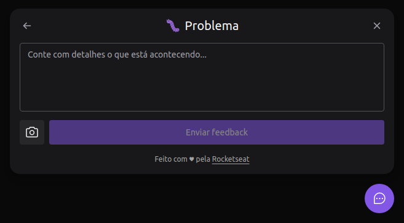

<h1 title="teste" align="center">
    🚀 Feedback Widget
</h1>

<p align="center">
    
</p>

## 💻 Link Preview
https://nlw-8-feedget.vercel.app/

## 🧪 Technologies

This project was developed with the following technologies:

- [React](https://reactjs.org)
- [React Native](https://firebase.google.com/)
- [Expo](https://expo.dev/)
- [Tailwind](https://tailwindcss.com/)
- [Prisma](https://www.prisma.io/)
- [Express](https://expressjs.com/)
- [TypeScript](https://www.typescriptlang.org/)

## 🚀 How to run

Clone the repository and access its folder.

```bash
$ git clone https://github.com/diogoditorr/nlw-8-feedget.git
$ cd nlw-8-feedget
```

<h3 align="center">Backend</h3>

Enter the `server` folder.

> Setting up environment variables:
> - **DATABASE_URL:** The database url the server will connect. [`PostgreSQL`](https://www.postgresql.org/) is the database selected in `Prisma` schema.

```bash
# Install dependencies
$ yarn

# Start the project
$ yarn dev
```

The server will be available in the browser at port **3333** or defined in the environment variables.

<h3 align="center">Frontend</h3>

Enter the `web` folder.

> Setting up environment variables:
> - **VITE_API_URL:** The `server` API URL.

```bash
# Install dependencies
$ yarn

# Start the project
$ yarn dev
```

<h3 align="center">Mobile</h3>

Enter the `mobile` folder.

```bash
# Install expo-cli globally
$ npm install -g expo-cli

# Install dependencies
$ expo install

# Start the project
$ expo start
```

## 💻 Project

Feedback Widget helps developers receive feedback from their users to fix bugs, create/improve features with suggestions, or anything else. Optionally, the user can send a screenshot of the screen.

An e-mail will be sent to the settled e-mail address in `server/src/adapters/nodemailer-mail-adapter.ts`. The [Nodemailer](https://nodemailer.com/about/) is the default e-mail service used.




This is a project developed all along with **Next Level Week Return** created by [Rocketseat](https://www.rocketseat.com.br/), presented from the 1st to the 8th of May 2022.


## 🔖 Layout

You can visualize the project's layout through the link below:

- [Layout](https://www.figma.com/file/17BFubWF7TCQxGVoG6XTXQ/Feedback-Widget-Community) 

You will need an account on [Figma](http://figma.com/).

## 📝 License

This project is under the MIT license. See the [LICENSE](LICENSE) file for more details.